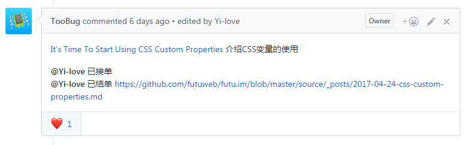
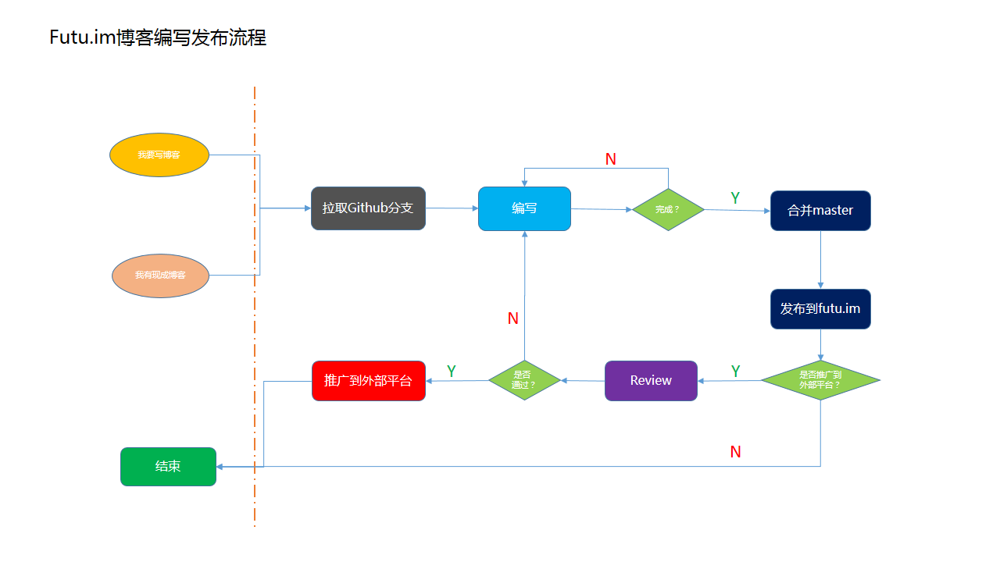

# 富途web开发团队博客

## URL

<https://futu.im> 请大力点击、观看、评论、赞、宣传、友情链接、分享……（省略1000个词）

## 程序

使用了著名的静态博客程序[Hexo](https://hexo.io)，写作使用Markdown。

> 所谓静态博客，是指文章在本地编写，然后生成静态html发布，整个网站在发布后是完全静态的，只包含html、js、css、图片等文件，不需要PHP、Node等环境，任意静态空间均可托管。

## 写作开始

### 文艺青年版

参考Hexo[官方文档](https://hexo.io/docs/)，首先需要安装`hexo-cli`：

```sh
npm install -g hexo-cli --registry=http://registry.npm.taobao.org
```

写作文章时，参考[官方文档](https://hexo.io/docs/writing.html)：

1. `hexo server`让hexo在本机跑起来，这样可以通过`http://localhost:4000`进行预览
2. `hexo new 2017-04-22-title-in-english`新建一篇文章

### 二逼青年版

从`source/_posts`中复制一篇，或者参考格式，自己新建一个`2017-04-22-title-in-english.md`文件

## 写作过程

就是写字啊，编辑啊，不停地按退格删除啊，一会复制一下粘贴一下什么的……

## 写作规范
写文章还是要有点规范才行，不然太混乱也不好。

1. 文章命名：YY-MM-DD-name.md (例如：2017-04-11-demo-01.md)
4. 文章上方的meta信息写清楚，包括作者、时间、分类等
5. 每篇文章必须设置`<!--more-->`标记，否则会在首页将文章全文显示出来，影响浏览
6. 图片目录按照文章名字命名放在images目录下
7. 假如你还没有作者简介，请到author目录添加自己的作者简介

所有的文件夹都是针对source目录来的。文章放在_post目录。

编写好后提交master。

## 文章内容
小编一下也想不全，大概的罗列了以下的几个主要的类型：

1. 工作总结（侧重于：工作中的一些总结）
2. 技术点分享
3. 问题剖析
4. 项目分享（侧重于：非工作项目）
5. 翻译文章 ( 文章小编可以提供 )
6. 新技术实践
7. 前端快讯（例如：一些前端的热点跟进）

虽然有点偏重前端技术，但是技术不分国界，我们欢迎。可能上面罗列的类别确实少了，但是不限于上面的类别，也可以写其它的，比如感想啊，软文啊...等等都可以的。

对于翻译的文章内容，Futu.im也提供的有，供给想要翻译的同学。放在了[Issues](https://github.com/futuweb/futu.im/issues)目录。

需要注意的是：翻译文章时记得标记你翻译的文章为：`已接单`，翻译完成发布了标记为：`已结单`。

文章的标题请加上`【译】`代表是翻译文章，文章底部加上翻译作者名称以及原创作者和原文链接。

修改评论：@你自己，表示你接的，这样其他人就不会重复翻译了。

例如：



## 托管和发布

源码托管在Github（<https://github.com/futuweb/futu.im>）上，`master`分支为发布分支。

master分支提交后，数分钟内上线。

1. review安排：Toobug，Nick，Jin把关

## 文章推广
文章发布并不是什么难事，合并到master分支就好。推广的话，需要对文章Review一下，过审才发表出去比较好。一个是对自己的文章负责，二是对读者负责。

1. 发布：发布master即可
2. 推广：review通过，发到相关平台（例如：前端早读课）
3. review安排：Toobug，Nick把关

## 附录


## weekly

JavaScript: [http://javascriptweekly.com/](http://javascriptweekly.com/) [https://medium.com/](https://medium.com/)

CSS: [http://css-weekly.com/archives/](http://css-weekly.com/archives/)

前端：[http://frontendweekly.co/](http://frontendweekly.co/)  [https://frontendfoc.us/](https://frontendfoc.us/)

Mb-Dev: [https://mobiledevweekly.com/](https://mobiledevweekly.com/)

WEB: [https://webopsweekly.com/](https://webopsweekly.com/)

Node: [https://nodeweekly.com/](https://nodeweekly.com/)

